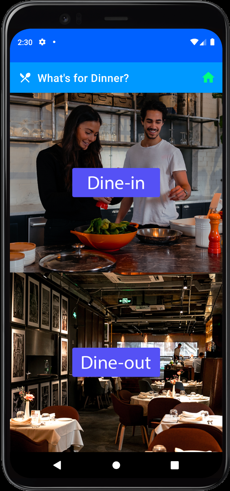
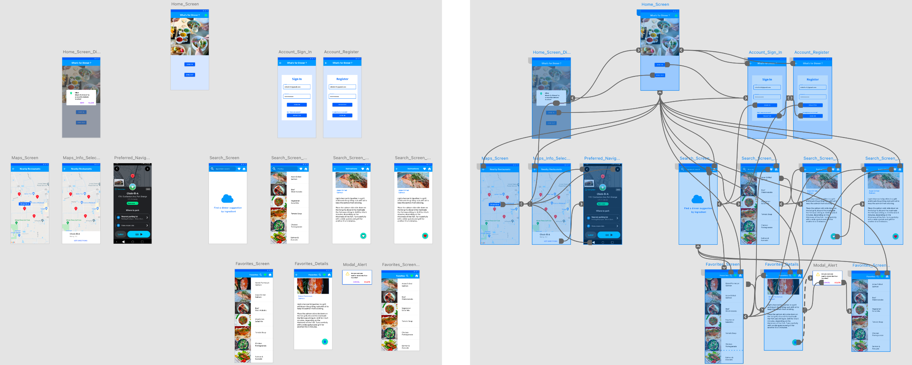
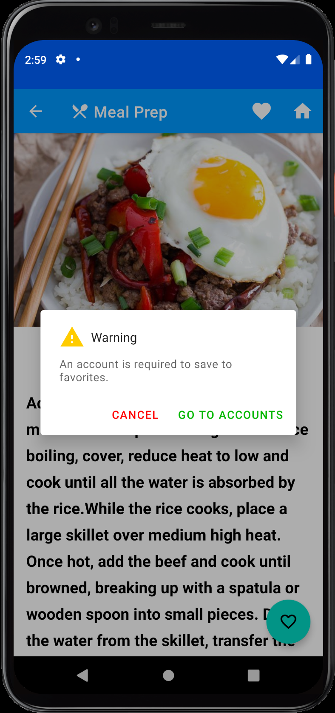

# 
Android Google Maps Project 

 

 <a href="https://developer.android.com" target="_blank" rel="noreferrer"> &nbsp;&nbsp;&nbsp;&nbsp;&nbsp;&nbsp&nbsp;<a href="https://firebase.google.com/" target="_blank" rel="noreferrer"> &nbsp;&nbsp;&nbsp;&nbsp;&nbsp;&nbsp&nbsp; </a> <a href="https://git-scm.com/" target="_blank" rel="noreferrer">  &nbsp;&nbsp;&nbsp;&nbsp;&nbsp;&nbsp&nbsp;</a>  

## Table of contents
* [Project Overview](#project-overview)
* [Integrative Research](#integrative-project-research)
* [Prototype](#prototype)
* [Illustrations](#illustrations)
* [Quick Links](#quick-links)
* [Copyright](#copyright)
* [Contact](#contact)

## Project Overview

App Name: __What's for Dinner__

  

 

__Main concepts__

* Provide up to 20 restaurant locations based on the user's GPS location.
* Provide directions to restaurants with Google Maps Navigation.
* Provide dinner suggestions based on the user's search criteria.
* Provide cooking instructions and a favorites list.

 

__Topics of Research__

* Google Firebase Firestore
* Google Maps SDK
* OkHttp Requests
* Spoonacular's Food-Recipe-Nutrition Database
* NearbyPlace's API
* Android Navigation: Top level navigation
* Android Bottom Sheet Dialog
* Material Design Dialog Box

## Integrative Project Research

> __'Right click'__ and open Google Drive link in new tab

[App Definition Statement](https://docs.google.com/document/d/1-WjvbyrUeKiPCQ_1aV3RnTcMMrhGf9u7/edit?usp=sharing&ouid=115860969731833325173&rtpof=true&sd=true)

[Project Research](https://docs.google.com/document/d/14F7B76u9hrESB6oRYT9-jL_FwbKY1hxx/edit?usp=sharing&ouid=115860969731833325173&rtpof=true&sd=true)

[User Stories & Functional Requirements](https://docs.google.com/spreadsheets/d/1h-yODjjGWOR0jdwim_ceX9dtYOjz237on1vEq01C3Rw/edit?usp=sharing)

## Prototype

> __'Right click'__ and open Adobe XD link in new tab

[Adobe XD Prototype](https://xd.adobe.com/view/6a2e9c2d-5078-4425-a59d-5b317f674807-3f7d/)

 

## Illustrations

<h2 align="center">** Please allow a few minutes for GIFs to load **   Thank you so much</h3>

 
 

  
&nbsp;&nbsp;&nbsp;&nbsp;&nbsp;&nbsp&nbsp;&nbsp;&nbsp;&nbsp;&nbsp&nbsp&nbsp;&nbsp;

 
 

  
&nbsp;&nbsp;&nbsp;&nbsp;&nbsp;&nbsp&nbsp;&nbsp;&nbsp;&nbsp;&nbsp&nbsp&nbsp;&nbsp;

 
 

  
&nbsp;&nbsp;&nbsp;&nbsp;&nbsp;&nbsp&nbsp;&nbsp;&nbsp;&nbsp;&nbsp&nbsp&nbsp;&nbsp;

 
 

  
&nbsp;&nbsp;&nbsp;&nbsp;&nbsp;&nbsp&nbsp;&nbsp;&nbsp;&nbsp;&nbsp&nbsp&nbsp;&nbsp;

 

## Quick Links

### [Click Here to View More Android Illustrations](https://github.com/EShenoda/Android-Illustrations)

### [Click Here to View iOS Illustrations](https://github.com/EShenoda/iOS-Game)

### [Click Here to View iOS Illustrations using SwiftUI](https://github.com/EShenoda/SwiftUI)

##  Copyright
Private Repo for EmilShenodaDev@gmail.com

All rights reserved: EmilShenoda@FullSailUniversity

## Contact
Created by [Emil Shenoda](mailto:EmilShenodaDev@gmail.com) - feel free to contact me!

[Back to top](#table-of-contents)