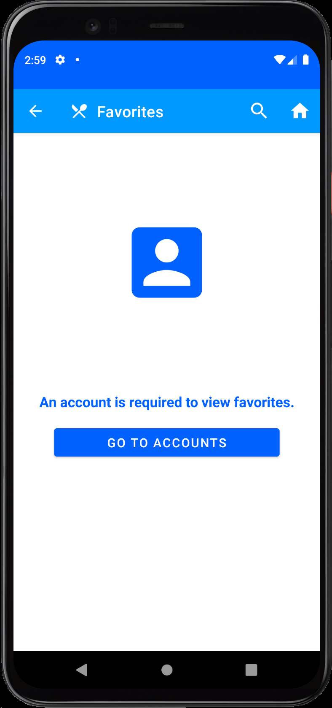

# Android Google Maps Project

 <a href="https://developer.android.com" target="_blank" rel="noreferrer"> &nbsp;&nbsp;&nbsp;&nbsp;&nbsp;&nbsp&nbsp;<a href="https://firebase.google.com/" target="_blank" rel="noreferrer"> &nbsp;&nbsp;&nbsp;&nbsp;&nbsp;&nbsp&nbsp; </a> <a href="https://git-scm.com/" target="_blank" rel="noreferrer">  &nbsp;&nbsp;&nbsp;&nbsp;&nbsp;&nbsp&nbsp;</a>  

 
 

<h2 align="center">** Please allow a few minutes for GIFs to load **   Thank you so much</h3>

 
 

## Project Overview

App Name: __What's for Dinner__

 

__Main concepts__

* Provide dinner suggestions based on the user's search criteria.
* Provide cooking instructions and a favorites list.
* Provide up to 20 restaurant locations based on the user's GPS location.
* Provide directions to restaurants with Google Maps Navigation.

 

__Topics of Research__

* Google Firebase Firestore
* Google Maps SDK
* OkHttp Requests
* Spoonacular's Food-Recipe-Nutrition Database
* NearbyPlace's API
* Android Navigation: Top level navigation
* Android Bottom Sheet Dialog

 

### Prototype

 
 

	
&nbsp;&nbsp;&nbsp;&nbsp;&nbsp;&nbsp&nbsp;&nbsp;&nbsp;&nbsp;&nbsp&nbsp&nbsp;&nbsp;

 
 

  
&nbsp;&nbsp;&nbsp;&nbsp;&nbsp;&nbsp&nbsp;&nbsp;&nbsp;&nbsp;&nbsp&nbsp&nbsp;&nbsp;

 
 

  
&nbsp;&nbsp;&nbsp;&nbsp;&nbsp;&nbsp&nbsp;&nbsp;&nbsp;&nbsp;&nbsp&nbsp&nbsp;&nbsp;

 
 

  
&nbsp;&nbsp;&nbsp;&nbsp;&nbsp;&nbsp&nbsp;&nbsp;&nbsp;&nbsp;&nbsp&nbsp&nbsp;&nbsp;

 
 

  
&nbsp;&nbsp;&nbsp;&nbsp;&nbsp;&nbsp&nbsp;&nbsp;&nbsp;&nbsp;&nbsp&nbsp&nbsp;&nbsp;

 
 

## [Click Here For More Android Illustrations](https://github.com/EShenoda/Android-Illustrations)

 

##  Copyright
Private Repo for EmilShenodaDev@gmail.com

All rights reserved: EmilShenoda@FullSailUniversity

## Contact
Created by [Emil Shenoda](mailto:EmilShenodaDev@gmail.com) - feel free to contact me!